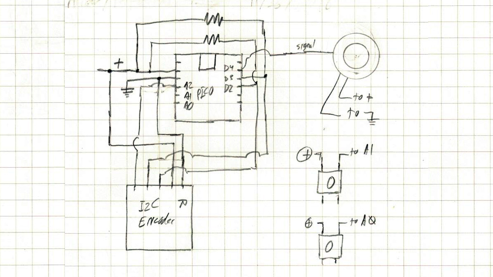

# RotaryControl

### Build videos

https://www.youtube.com/playlist?list=PLUSVaS5vtdgQBRD3hqpD_LZi0aTD-GRQe

### Purchased Electronics Needed

5x7 Perf board \
I2C Rotary Encoder: https://www.tindie.com/products/Saimon/i2cencoder-v2-connect-multiple-encoder-on-i2c-bus/ \
MellBell PICO: https://mellbell.cc/products/pico \
NeoPixel Ring: https://www.adafruit.com/product/1643 \
Rotary Encoder \
Encoder knob: https://www.ebay.com/itm/K9-0-25-Dia-Black-Aluminum-Rotary-Control-Potentiometer-Knob-25mm-x-15mm/253315168134 \
Pushbuttons \
Wire

### 3D Print Stuff

Clear PLA https://amzn.to/2MXi3qr (Amazon Affiliate) \
Black PLA https://amzn.to/31PlYd2 (Amazon Affiliate) \
Plasti Dip Spray https://amzn.to/34lU22f (Amazon Affiliate - not sure if this is the correct type)

### Wiring Diagram

### Other Info

This post was helpful to figure out how to use the caps lock functionality: https://www.instructables.com/id/USB-Volume-Control-and-Caps-Lock-LED-Simple-Cheap-/ \
Code referenced in [Arrow Encoder article](https://www.arrow.com/en/research-and-events/articles/rotary-encoders-how-to-pair-with-an-arduino-board): https://github.com/JeremySCook/ArduinoEncoder
