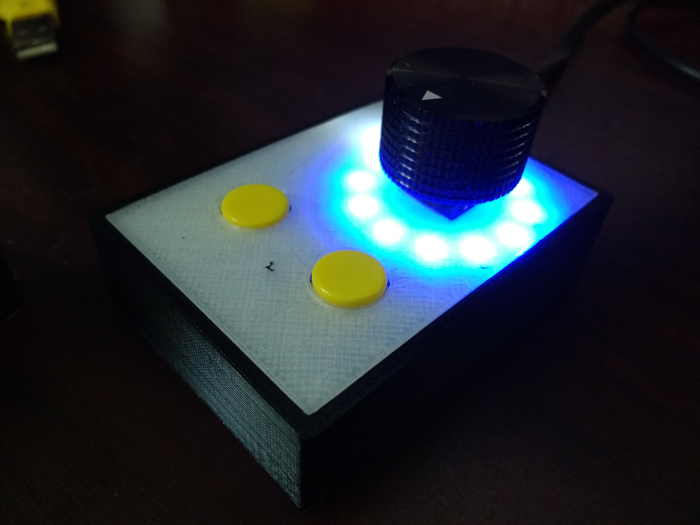

# RotaryControl

Rotary control with PICO and I2C encoder.

Build video: https://www.youtube.com/watch?v=ePKGLnjlXl4

Note that i2cEncoderLibV2.cpp and i2cEncoderLibV2.h will be needed in the same directory.

Purchased Electronics Needed:

5x7 Perf board

I2C Rotary Encoder: https://www.tindie.com/products/Saimon/i2cencoder-v2-connect-multiple-encoder-on-i2c-bus/

MellBell PICO: https://mellbell.cc/products/pico

NeoPixel Ring: https://www.adafruit.com/product/1643

Rotary Encoder

Pushbuttons

Wire

This post was helpful to figure out how to use the caps lock functionality: https://www.instructables.com/id/USB-Volume-Control-and-Caps-Lock-LED-Simple-Cheap-/

Code referenced in [Arrow Encoder article](https://www.arrow.com/en/research-and-events/articles/rotary-encoders-how-to-pair-with-an-arduino-board): https://github.com/JeremySCook/ArduinoEncoder
